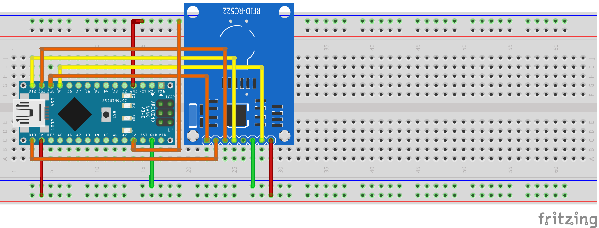

# MyFareMonitor

The MyFareMonitor kombines a lot of functions of the Arduino MFCR522 Library (v1.1.8).





__Table of content__

- [Install](#install)
- [Remark](#Remark)
- [Usage](#Usage)


## Install<a id="install"></a>

Copy all files in subdirectory named MyFareMonitor under your Arduino directory.<br>
I you set <b>DEBUG 1</b>, you need the "MemoryFree" Library from:<br>
<a href='http://www.domore.be/1arduino-understanding-memory-management.aspx'>http://www.domore.be/1arduino-understanding-memory-management.aspx</a>


## Remark<a id="Remark"></a>

These Arduino Sketch is based of the deafault MFCR522 Library (v1.1.8).<br>
You can modify the most things about of a MiFare Classic Card like BlockRead, BlockWrite, etc...<br>
Also exist a few subcommands for the MCFR522Chip byself.

> There are only minimal checking of lengt while setting KEY A or write block commands.
>
> BE CAREFULLY. ON WRONG SIZE OF LENGTH, THE INFECTED SECTOR WILL BE BLOCKED FOR EVER! 

## Usage<a id="Usage"></a>

Commands are:

- [help](#help)
- [get Card UID](#guid)
- [get CardType](#gct)
- [get Rx Gain](#gg)
- [set Rx gain](#sg)
- [access bits to hex] (#ab2hex)
- [hex to access bits] (#hex2ab)
- [set key] (#sk)
- [dump key] (#dk)
- [dump card](#dc)
- [dump sector](#ds)
- [dump block in ascii](#dba)
- [dump block in HEX](#dbh)
- [write ascii text to block](#wba)
- [write hex values to block](#wbh)
- [set value](#sv)
- [get value](#gv)
- [increment value](#iv)
- [decrement value](#dv)


## help<a id="help"></a>

The command 'h' shows the helpscreen.

```
MyFare Monitor V 2.3 (2017-02-09)
(c)2016 Andreas Bujok
=============
Help:
 h     : print help

 guid  : get Card UID
 gct   : get CardType
 gg    : get Rx Gain
 sg,<gain> : set Rx gain <0-7> (18dB - 48dB)
 dk        : dump key
 sk,<KEY> : set key (6 hex values). Has <KEY> no value, key will be set to transport key.
 ab2hex,<value block 0>,<value block 1>,<value block 2>,<value block 3> : convert access bits to hex values for trailerblock
 hex2ab,<value 0>,<value 1>,<value 2> : convert hex values to access bits for trailerblock

 dc    : dump card, use fix the transportkey.
 ds,<sector> : dump sector <0-n>, use fix the transportkey.
 dba,<block>,[<'a'|'b'>] : dump in ascii of block <0-n> with KEY A|B (default is A)
 dbh,<block>,[<'a'|'b'>] : dump in HEX of block <0-n> with KEY A|B (default is A)
 wba,<block>,<ascii-data>,[<'a'|'b'>],[<startpoint>] : write ascii text to block <0-n> (max. 16 char.), with key A|B (default is A), start position (default is 1)
 wbh,<block>,<hex-data>  ,[<'a'|'b'>],[<startpoint>] : write hex values to block <0-n> (max. 32 char.), with key A|B (default is A), start position (default is 1)

 sv,<block>,<val> : set value to valueblock <n>
 gv,<block> : get value of valueblock <n>
 iv,<block>,<val> : increment valueblock <n> with value <val>
 dv,<block>,<val> : decrement valueblock <n> with value <val>

```

[back to usage] (#Usage)

## get Card UID<a id="guid"></a>

Read the ID of the MiFare Classic Card.

```
Syntax: guid
```
[back to usage] (#Usage)


## get CardType<a id="gct"></a>
Get the type of the MiFare Clasic Card.

```
Syntax: gct
```
[back to usage] (#Usage)

## get Rx Gain<a id="gg"></a>
Shows the current Gain (dB) of the receiver.

```
Syntax: gg
```
[back to usage] (#Usage)

## set Rx gain<a id="sg"></a>
Set the Gain (0-7) of the receiver.

Value | dB
------| ------
0 | 18dB
1 | 23dB
2 | 18dB
3 | 23dB
4 | 33dB
5 | 38dB
6 | 43dB
7 | 48dB


```
Syntax: sg,<0-7>
```
[back to usage] (#Usage)

## dump key <a id="dk"></a>
Shows the value of used software Key in HEX-digits for authentications of Key A or Key B.

```
Syntax: dk
```
[back to usage] (#Usage)

## set key <a id="sk"></a>
Set the value of the software Key A in HEX- digits (max. 6 HEX-pairs). 
Used for authentications Key A or Key B.<br>
If none value given, the key will be set to the value of the transportkey (FFFFFFFFFFFF).

```
Syntax: sk,<six 2-digit HEX values><br>
Syntax: sk,
```
[back to usage] (#Usage)

## access bits to hex<a id="ab2hex"></a>
Print the three byte hexvalues for the trailerblock based of the given conditions of block 0 to 3 of each sector. <br>
Check the datasheet from NPX for possible combination.

```
Syntax: ab2hex,<value block 0>,<value block 1>,<value block 2>,<value block 3>
```
[back to usage] (#Usage)

## hex to access bits<a id="hex2ab"></a>
Print the access values for the different blocks of each sector given by the hexvalues of the trailerblock. <br>
Check the datasheet from NPX for possible combination.

```
Syntax: hex2ab,<6 byte hex value>
```
[back to usage] (#Usage)


## dump card<a id="dc"></a>
Dump the full data (sectors and blocks) of the complete MiFare Classic Card

```
Syntax: dc
```
[back to usage] (#Usage)

## dump sector<a id="ds"></a>
Shows the blocks of the given sector.<br>
Use 'key' for auth A.

```
Syntax: ds,<sector>
```
[back to usage] (#Usage)

## dump block as ascii<a id="dba"></a>
Shows the 16 Bytes of the given block as ASCII characters, given by the prepared key.

```
Syntax: dba,<block n>,<auth with key as A|key as B>
```
[back to usage] (#Usage)

## dump block as HEX<a id="dbh"></a>
Shows the 16 Bytes of the given block as HEX digits.

```
Syntax: dba,<block n>,<auth with key as A|key as B>
```
[back to usage] (#Usage)

## write ascii text to block<a id="wba"></a>
Writes ASCII Text to the given block. <br>Additional the auth key A|B and startpoint can be given (1 - 16), the value for key and startpoint is not necessary.

The default auth key is A and start is on position one. 

```
Syntax: wba,<block n>,<ASCII text>,[key A|B],[start position]
```
[back to usage] (#Usage)

## write hex values to block<a id="wbh"></a>
Writes HEX digits to the given block. <br>Additional the auth key A|B and startpoint can be given (1 - 16), the value for key and startpoint is not necessary.

The default auth key is A and start is on position one.

```
Syntax: wbh,<block n>,<2-digit HEX values>,[key A|B],[<start position>]
```
[back to usage] (#Usage)

## set value (to value block)<a id="sv"></a>
Set the value of a value block.<br>
Value are an signed 4-byte value, negative values are stored in standard 2 ́s complement 
format.

```
Syntax: sv,<value block n>,<value>
```
[back to usage] (#Usage)

## get value (of value block)<a id="gv"></a>
Get the value of an given value block.

```
Syntax: gv,<value block n>
```
[back to usage] (#Usage)

## increment value (of value block)<a id="iv"></a>
Increment the current value of an given value block by the given value.

```
Syntax: iv,<value block n>,<val>
```
[back to usage] (#Usage)

## decrement value (of value block)<a id="dv"></a>
Decrement the current value of an given value block by the given value.

```
Syntax: dv,<value block n>,<val>
```
[back to usage] (#Usage)

© Andreas Bujok


